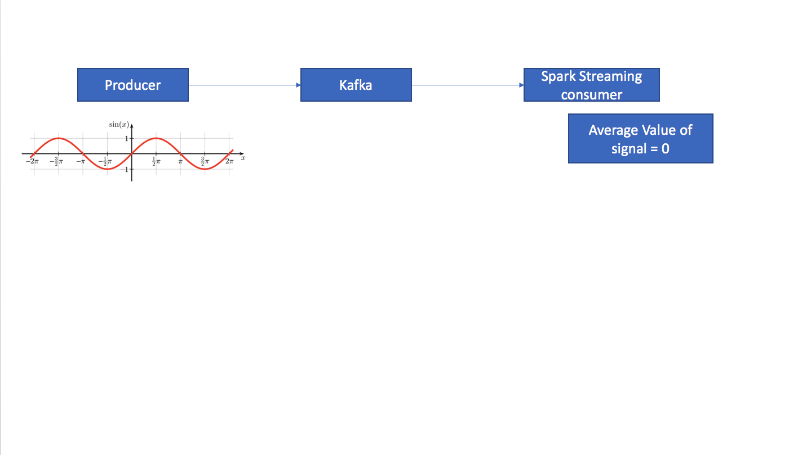

## Spark Streaming

Thi is my hello world using Spark Streaming!!

#Kafka

Please find some utility scripts inside the scripts folder.

#Producer:

launch:

<code>
com.example.Producer
</code>

#Consumer

<code>
com.example.Consumer
</code>

If everything goes right, the average value of the signal should be 0.

